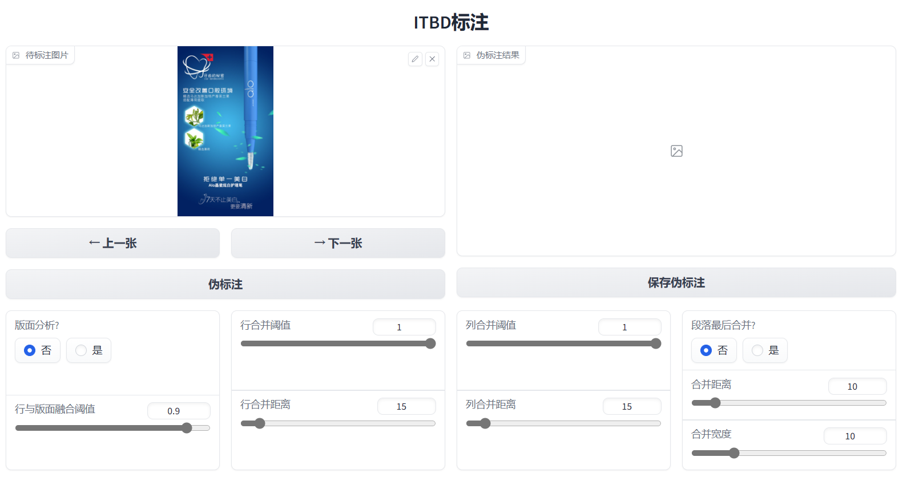

 # <a href="https://challenge.xfyun.cn/topic/info?type=image-text&ch=0y8g5ox">图片文本块检测挑战赛</a>解决方案分享

    <a href="https://challenge.xfyun.cn/?ch=0y8g5ox">2023 iFLYTEK DEVELOPER COMPETATION</a> 
    A榜：第1 | B榜：第6

图片文本块检测是指检测出图片中完整且位置独立的文本块，并输出对应位置的任务，属于图片文档分析（Document Image Analysis，包括文档版面分析、表格检测等）中的任务之一。 图片文本块检测具有广泛的应用价值，例如：在生活、工作拍照翻译场景中，如果直接利用行粒度的识别结果做下游的翻译任务，会出现单行信息不完整，导致翻译结果信息缺失。  

# 数据分析
既包含行检测类型（广告等），又包含段落检测类型（文档等）。

# 辅助标注工具

    

思路：以DBNet为基础进行行检测，对行检测结果进行合并。

